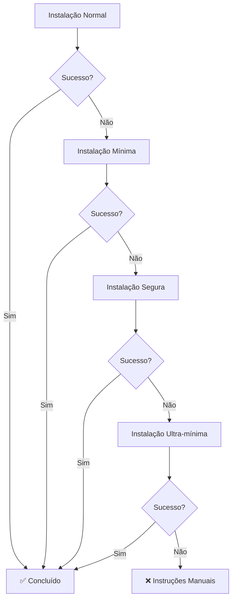

# OUDS - Guia de Resolução de Conflitos RPM

## 🚨 Problema: "Cannot uninstall requests 2.25.1, RECORD file not found. Hint: The package was installed by rpm."

Este erro é comum em sistemas Linux (CentOS, RHEL, Fedora) onde alguns pacotes Python foram instalados via gerenciador de pacotes do sistema (rpm/yum/dnf) em vez do pip.

## 🔧 Soluções Implementadas

### 1. Script de Instalação Segura
```bash
./install-safe.sh
```

Este script tenta múltiplas estratégias:
- Instalação normal
- Instalação com `--user`
- Instalação com `--force-reinstall`
- Instalação com `--no-deps`

### 2. Instalação Manual Segura
```bash
# Instalar em diretório do usuário (evita conflitos)
pip3 install --user --force-reinstall requests>=2.28.0

# Ou instalar sem dependências
pip3 install --user --no-deps requests>=2.28.0
```

### 3. Usando Ambiente Virtual (Recomendado)
```bash
# Criar ambiente virtual
python3 -m venv ouds-env

# Ativar ambiente virtual
source ouds-env/bin/activate

# Instalar dependências no ambiente isolado
pip install -r requirements.txt

# Executar OUDS
python api_server.py
```

### 4. Instalação Mínima de Emergência
```bash
pip3 install --user fastapi uvicorn pydantic openai tiktoken
```

## 🔍 Diagnóstico de Conflitos

Execute o diagnóstico para identificar pacotes problemáticos:
```bash
./diagnose.sh
```

O script verificará:
- Pacotes instalados via RPM vs pip
- Versões conflitantes
- Dependências faltantes

## 📋 Pacotes Comuns com Conflitos RPM

| Pacote | RPM Package | Solução |
|--------|-------------|---------|
| requests | python3-requests | `pip3 install --user --force-reinstall requests` |
| pyyaml | python3-pyyaml | `pip3 install --user --force-reinstall pyyaml` |
| urllib3 | python3-urllib3 | `pip3 install --user --force-reinstall urllib3` |
| certifi | python3-certifi | `pip3 install --user --force-reinstall certifi` |

## 🛠️ Estratégias de Resolução

### Estratégia 1: Instalação com --user
```bash
pip3 install --user <pacote>
```
- Instala no diretório do usuário (~/.local/lib/python3.x/site-packages)
- Evita conflitos com pacotes do sistema
- Não requer privilégios de administrador

### Estratégia 2: Force Reinstall
```bash
pip3 install --user --force-reinstall <pacote>
```
- Força a reinstalação mesmo se já existir
- Sobrescreve versões conflitantes

### Estratégia 3: No Dependencies
```bash
pip3 install --user --no-deps <pacote>
```
- Instala apenas o pacote, sem dependências
- Útil quando dependências causam conflitos

### Estratégia 4: Ambiente Virtual
```bash
python3 -m venv venv
source venv/bin/activate
pip install <pacote>
```
- Isolamento completo do sistema
- Solução mais limpa e recomendada

## 🚀 Instalação Automática com Fallback

O script `install_ouds.sh` implementa fallback automático:

1. **Nível 1:** Instalação completa (`requirements.txt`)
2. **Nível 2:** Instalação mínima (`requirements-minimal.txt`)
3. **Nível 3:** Instalação segura (`install-safe.sh`)
4. **Nível 4:** Instalação ultra-mínima (`requirements-core.txt`)
5. **Emergência:** Instruções para instalação manual

## 💡 Dicas Importantes

### Para Administradores de Sistema:
- Evite misturar pip e rpm para pacotes Python
- Use ambientes virtuais para aplicações
- Considere usar `pipx` para ferramentas CLI

### Para Desenvolvedores:
- Sempre use ambientes virtuais em desenvolvimento
- Documente dependências específicas do sistema
- Teste em containers para reproduzir problemas

### Para Usuários:
- Use `--user` quando não tiver privilégios de admin
- Execute `./diagnose.sh` antes de reportar problemas
- Mantenha backup de ambientes funcionais

## 🔄 Processo de Resolução Automática



## 📞 Suporte

Se os problemas persistirem:

1. Execute `./diagnose.sh` e compartilhe o resultado
2. Verifique logs de erro detalhados
3. Considere usar Docker para isolamento completo
4. Consulte a documentação específica da sua distribuição Linux

---

**OUDS v1.0.3** - Sistema robusto com resolução automática de conflitos

